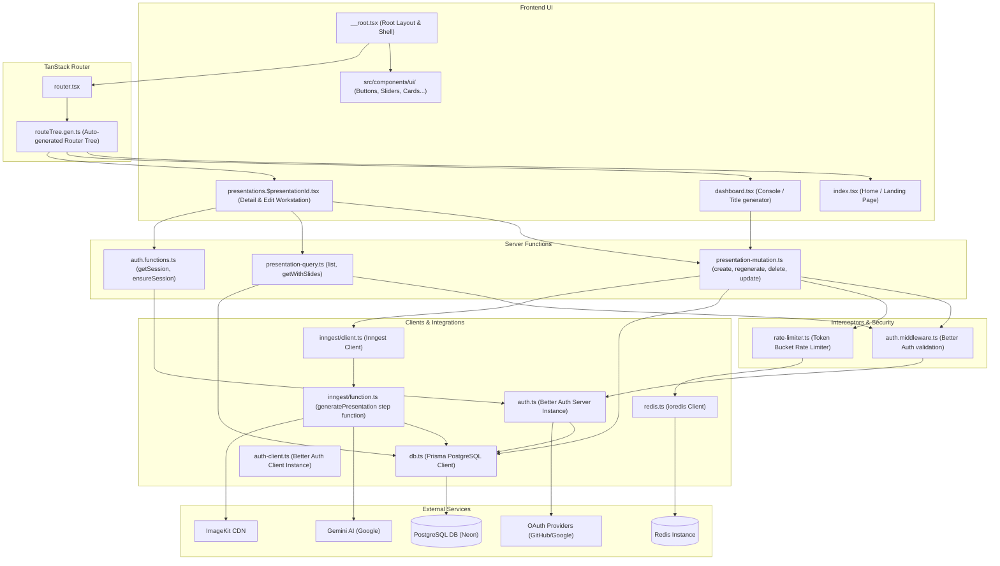

# Project Architecture and File Relationships

This document provides a detailed explanation of the project structure, what each file and folder does, and how they are interconnected through imports and data flows.

---

## 1. High-Level Architecture Overview

SynthSlides is a full-stack presentation generator built using **TanStack Start** (SSR framework for React and TanStack Router).
- **Backend & Database**: PostgreSQL (accessed via Prisma ORM) and Redis (accessed via `ioredis` for Token Bucket rate limiting).
- **Authentication**: Managed via **Better Auth** with GitHub and Google OAuth.
- **Asynchronous Task Queue**: Powered by **Inngest** for triggering and processing long-running AI presentation generation jobs.
- **AI Engine**: Google **Gemini 2.5 Flash** (via Vercel AI SDK) for generating the presentation outline, slides text content, and slide image prompts.
- **Image Hosting**: **ImageKit** for delivering and generating slide illustrations dynamically.

---

## 2. Mermaid Connection Diagram

The diagram below visualizes the dependencies and flows from the user interface down to database engines and external APIs.

---

## 3. Directory and File Breakdown

### Root Directory Configuration Files
- [package.json](file:///d:/coding-projects/ppt%20generator/ppt-generator-ai/package.json): Lists dependencies, project scripts, and compiler packages.
- [vite.config.ts](file:///d:/coding-projects/ppt%20generator/ppt-generator-ai/vite.config.ts): Configures the Vite build system, integrating Tailwind CSS (`@tailwindcss/vite`) and TanStack Router plugin (`@tanstack/router-plugin`).
- [tsconfig.json](file:///d:/coding-projects/ppt%20generator/ppt-generator-ai/tsconfig.json): Defines TypeScript compilation rules and import alias mappings (e.g. `#/*` pointing to `./src/*`).
- [prisma.config.ts](file:///d:/coding-projects/ppt%20generator/ppt-generator-ai/prisma.config.ts): Configuration for Prisma CLI, schema paths, seed command, and database URLs.
- [.env](file:///d:/coding-projects/ppt%20generator/ppt-generator-ai/.env): Stores environment variables (Neon PostgreSQL database credentials, Better Auth secrets, OAuth IDs, Gemini API keys, ImageKit endpoints, and Redis URL).

### `prisma/` Folder
- [prisma/schema.prisma](file:///d:/coding-projects/ppt%20generator/ppt-generator-ai/prisma/schema.prisma): The central database schema file mapping models for `User`, `Account`, `Session`, `Verification`, `Presentation` (status tracking), and `Slide` (individual presentation slides).

### `src/` Folder Root
- [src/db.ts](file:///d:/coding-projects/ppt%20generator/ppt-generator-ai/src/db.ts): Instantiates the Prisma Client using the server's PostgreSQL connection. Used across all server actions, authentication libraries, and Inngest task scripts.
- [src/redis.ts](file:///d:/coding-projects/ppt%20generator/ppt-generator-ai/src/redis.ts): Instantiates the `ioredis` client with HMR reload protection. Used strictly inside the rate limiter middleware.
- [src/router.tsx](file:///d:/coding-projects/ppt%20generator/ppt-generator-ai/src/router.tsx): Configures the TanStack Router instance, combining generated routes, SSR hydration context, and react-query integrations. Used by TanStack Start entry scripts.
- [src/routeTree.gen.ts](file:///d:/coding-projects/ppt%20generator/ppt-generator-ai/src/routeTree.gen.ts): Auto-generated file by the TanStack Router plugin that indexes all files in `src/routes/` to build the app's route structure.
- [src/styles.css](file:///d:/coding-projects/ppt%20generator/ppt-generator-ai/src/styles.css): Global layout styles, base configurations, and visual variables.

---

### `src/routes/` Directory (App Pages & Server Endpoint Routing)
- [src/routes/__root.tsx](file:///d:/coding-projects/ppt%20generator/ppt-generator-ai/src/routes/__root.tsx): Root layout element containing the top-level HTML document shell, navigation bar, sonner toaster component, and TanStack Router/Query devtools.
- [src/routes/index.tsx](file:///d:/coding-projects/ppt%20generator/ppt-generator-ai/src/routes/index.tsx): The home landing page introducing the generator tool and prompting new users to sign in.
- [src/routes/dashboard.tsx](file:///d:/coding-projects/ppt%20generator/ppt-generator-ai/src/routes/dashboard.tsx): The console page dashboard where users enter content details, set parameters (slide count, style, layout, tone), and initiate presentation generation. Imports `createPresentation` and `listPresentations`.
- [src/routes/presentations.$presentationId.tsx](file:///d:/coding-projects/ppt%20generator/ppt-generator-ai/src/routes/presentations.$presentationId.tsx): The slide workstation page. Allows users to view compiled slide lists, toggle fullscreen slideshow mode, export slides as a PPTX file, edit configuration metadata, and trigger regeneration. Imports details hooks and presentation queries.
- [src/routes/api/auth/$.ts](file:///d:/coding-projects/ppt%20generator/ppt-generator-ai/src/routes/api/auth/$.ts): Server API route catching and passing requests directly to the Better Auth backend handler.
- [src/routes/api/inngest.ts](file:///d:/coding-projects/ppt%20generator/ppt-generator-ai/src/routes/api/inngest.ts): Server API route servicing Inngest event hooks and running worker functions.

---

### `src/middleware/` Directory (Interceptors)
- [src/middleware/auth.middleware.ts](file:///d:/coding-projects/ppt%20generator/ppt-generator-ai/src/middleware/auth.middleware.ts): Exports:
  - `authMiddleware`: Request-level middleware that validates user sessions and redirects unauthenticated users to `/login`.
  - `authFnMiddleware`: Function-level equivalent to protect queries and server functions.
- [src/middleware/rate-limiter.ts](file:///d:/coding-projects/ppt%20generator/ppt-generator-ai/src/middleware/rate-limiter.ts): Exports:
  - `rateLimitMiddleware`: Request-level middleware enforcing the Token Bucket rate limit algorithm. Executes an atomic Lua script in Redis preventing a user from making more than 3 slide requests per 24 hours. Calculates and reports the precise remaining cooldown time.

---

### `src/features/presentations/` Directory (Feature Domain)
- **`actions/`**:
  - [presentation-mutation.ts](file:///d:/coding-projects/ppt%20generator/ppt-generator-ai/src/features/presentations/actions/presentation-mutation.ts): Exports server functions (`createPresentation`, `updatePresentation`, `deletePresentation`, `regeneratePresentation`). Chained with `authMiddleware` and `rateLimitMiddleware`. Triggers the `presentation/generate` event inside Inngest.
  - [presentation-query.ts](file:///d:/coding-projects/ppt%20generator/ppt-generator-ai/src/features/presentations/actions/presentation-query.ts): Exports server functions (`getPresentationWithSlides` and `listPresentations`) to retrieve presentation records.
- **`components/`**:
  - [generation-status.tsx](file:///d:/coding-projects/ppt%20generator/ppt-generator-ai/src/features/presentations/components/generation-status.tsx): Badge display showing compiling/draft states.
  - [presentation-card.tsx](file:///d:/coding-projects/ppt%20generator/ppt-generator-ai/src/features/presentations/components/presentation-card.tsx): Card linking to individual presentation details.
  - [presentation-list-section.tsx](file:///d:/coding-projects/ppt%20generator/ppt-generator-ai/src/features/presentations/components/presentation-list-section.tsx): Layout block compiling historic lists.
  - [slide-card.tsx](file:///d:/coding-projects/ppt%20generator/ppt-generator-ai/src/features/presentations/components/slide-card.tsx): Sidebar slide indicator element.
  - [slide-preview.tsx](file:///d:/coding-projects/ppt%20generator/ppt-generator-ai/src/features/presentations/components/slide-preview.tsx): Beautifully renders individual slide data including title, content, speaker notes, and illustrations.
  - [slideshow-modal.tsx](file:///d:/coding-projects/ppt%20generator/ppt-generator-ai/src/features/presentations/components/slideshow-modal.tsx): Fullscreen slideshow swiper.
- **`hooks/`**:
  - [usePresentation-detail.ts](file:///d:/coding-projects/ppt%20generator/ppt-generator-ai/src/features/presentations/hooks/usePresentation-detail.ts): Component hook encapsulating mutation triggers and invalidation hooks.
  - [query-keys.ts](file:///d:/coding-projects/ppt%20generator/ppt-generator-ai/src/features/presentations/hooks/query-keys.ts): Defines cache query keys for React Query.
  - [use-fullscreen.ts](file:///d:/coding-projects/ppt%20generator/ppt-generator-ai/src/features/presentations/hooks/use-fullscreen.ts): Manages browser-native fullscreen presentation mode.
- **`lib/`**:
  - [export-pptx.ts](file:///d:/coding-projects/ppt%20generator/ppt-generator-ai/src/features/presentations/lib/export-pptx.ts): Compiles individual slides deck using `pptxgenjs` to save files locally.
- **`utils/`**:
  - [thumbnail-url.ts](file:///d:/coding-projects/ppt%20generator/ppt-generator-ai/src/features/presentations/utils/thumbnail-url.ts): Generates sample preview illustrations for slide decks.
- **`types/`**:
  - [schema.ts](file:///d:/coding-projects/ppt%20generator/ppt-generator-ai/src/features/presentations/types/schema.ts): Exports Zod validation schema schemas.

---

### `src/integrations/` Directory (External Client Connectors)
- **`better-auth/`**:
  - [header-user.tsx](file:///d:/coding-projects/ppt%20generator/ppt-generator-ai/src/integrations/better-auth/header-user.tsx): Connects to `auth-client.ts` to show profile info and trigger sign-out actions in the navbar.
- **`inngest/`**:
  - [client.ts](file:///d:/coding-projects/ppt%20generator/ppt-generator-ai/src/integrations/inngest/client.ts): Exports Inngest event processor instance.
  - [function.ts](file:///d:/coding-projects/ppt%20generator/ppt-generator-ai/src/integrations/inngest/function.ts): Core presentation generator step engine. Intercepts `presentation/generate` triggers, requests slide content structures from **Google Gemini**, cleans Prisma records, constructs slides, and assigns ImageKit picture sources.
- **`tanstack-query/`**:
  - [root-provider.tsx](file:///d:/coding-projects/ppt%20generator/ppt-generator-ai/src/integrations/tanstack-query/root-provider.tsx): Standard client-side Query Provider.
  - [devtools.tsx](file:///d:/coding-projects/ppt%20generator/ppt-generator-ai/src/integrations/tanstack-query/devtools.tsx): Panel hooks showing server caching states.

---

### `src/lib/` Directory (Generic Global Utilities)
- [src/lib/auth.ts](file:///d:/coding-projects/ppt%20generator/ppt-generator-ai/src/lib/auth.ts): Server-side configuration for social credentials (GitHub/Google OAuth) and Prisma bindings.
- [src/lib/auth-client.ts](file:///d:/coding-projects/ppt%20generator/ppt-generator-ai/src/lib/auth-client.ts): Client-side authentication driver.
- [src/lib/auth.functions.ts](file:///d:/coding-projects/ppt%20generator/ppt-generator-ai/src/lib/auth.functions.ts): Exports helper server functions checking current active sessions.
- [src/lib/auth_paths.ts](file:///d:/coding-projects/ppt%20generator/ppt-generator-ai/src/lib/auth_paths.ts): Defines public path lists and path checkers.
- [src/lib/utils.ts](file:///d:/coding-projects/ppt%20generator/ppt-generator-ai/src/lib/utils.ts): Tailwind CSS classes merging helper (`cn`).
